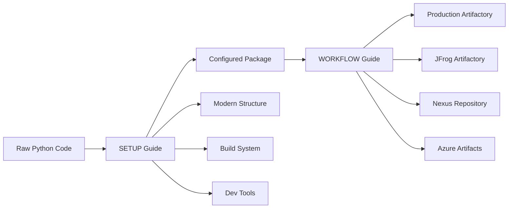

# Artifactory Packaging & Publishing Workflow

This guide provides step-by-step workflows for packaging your EDA-to-Model Scaffold and publishing it to various artifactory systems using modern Python tooling.

## Complete Workflow Overview


----

**Prerequisites**: If you're starting with raw Python code, first complete the [ARTIFACTORY_WORKFLOW_SETUP.md](./ARTIFACTORY_WORKFLOW_SETUP.md) guide to prepare your project. This workflow guide assumes you have a properly configured Python package.

## Table of Contents

- [Prerequisites](#prerequisites)
- [Quick Start Workflows](#quick-start-workflows)
- [Detailed Workflows by Artifactory Type](#detailed-workflows-by-artifactory-type)
- [Development to Production Pipeline](#development-to-production-pipeline)
- [Troubleshooting](#troubleshooting)
- [Security Best Practices](#security-best-practices)

## Prerequisites

### Required Tools
```bash
# Ensure you have these tools installed
uv --version        # UV package manager
python --version    # Python 3.10+
git --version       # Git for version control

# Optional but recommended
poetry --version    # Poetry (alternative to UV)
twine --version     # Package uploading (install with: uv pip install twine)
```

### Environment Setup
```bash
# Clone and setup project
git clone <your-repo-url>
cd eda_to_model_scaffold

# Create and activate virtual environment
uv venv
source .venv/bin/activate  # Linux/Mac
# or .venv\Scripts\activate  # Windows

# Install development dependencies
uv pip install -e ".[dev,test]"
```

## Quick Start Workflows

### Workflow 1: Corporate JFrog Artifactory

```bash
# 1. Prepare release
git checkout main
git pull origin main
# Update version in pyproject.toml if needed

# 2. Build package
uv pip install build twine
python -m build

# 3. Configure artifactory (one-time setup)
cat > ~/.pypirc << EOF
[distutils]
index-servers = artifactory

[artifactory]
repository = https://your-company.jfrog.io/artifactory/api/pypi/pypi-local/
username = your-username
password = your-api-token
EOF

# 4. Upload to artifactory
twine upload --repository artifactory dist/*

# 5. Install from artifactory (verification)
uv pip install eda-to-model-scaffold --index-url https://your-company.jfrog.io/artifactory/api/pypi/pypi-local/simple
```

### Workflow 2: Nexus Repository Manager

```bash
# 1. Build package
python -m build

# 2. Configure Nexus (one-time setup)
export TWINE_REPOSITORY_URL=https://nexus.company.com/repository/pypi-hosted/
export TWINE_USERNAME=your-username
export TWINE_PASSWORD=your-password

# 3. Upload to Nexus
twine upload dist/*

# 4. Install from Nexus
uv pip install eda-to-model-scaffold --index-url https://nexus.company.com/repository/pypi-group/simple
```

### Workflow 3: Azure DevOps Artifacts

```bash
# 1. Install Azure artifacts authentication
uv pip install keyring artifacts-keyring

# 2. Build package
python -m build

# 3. Upload to Azure Artifacts
twine upload --repository-url https://pkgs.dev.azure.com/your-org/_packaging/your-feed/pypi/upload/ dist/*

# 4. Install from Azure Artifacts
uv pip install eda-to-model-scaffold --index-url https://pkgs.dev.azure.com/your-org/_packaging/your-feed/pypi/simple
```

## Detailed Workflows by Artifactory Type

### JFrog Artifactory (Detailed)

#### Initial Setup
```bash
# 1. Create API token in JFrog UI
# Go to: User Profile → Authentication Settings → Generate API Key

# 2. Configure authentication
mkdir -p ~/.config/pip
cat > ~/.config/pip/pip.conf << EOF
[global]
extra-index-url = https://your-company.jfrog.io/artifactory/api/pypi/pypi-virtual/simple
trusted-host = your-company.jfrog.io
EOF

# 3. Setup .pypirc for publishing
cat > ~/.pypirc << EOF
[distutils]
index-servers = 
    pypi
    jfrog-local
    jfrog-virtual

[pypi]
repository = https://upload.pypi.org/legacy/
username = __token__
password = <your-pypi-token>

[jfrog-local]
repository = https://your-company.jfrog.io/artifactory/api/pypi/pypi-local/
username = your-username
password = <your-api-token>

[jfrog-virtual]
repository = https://your-company.jfrog.io/artifactory/api/pypi/pypi-virtual/
username = your-username
password = <your-api-token>
EOF
```

#### Development Workflow
```bash
# 1. Feature development
git checkout -b feature/new-model-type
# ... make changes ...
git add .
git commit -m "Add new model type support"

# 2. Test locally
uv pip install -e ".[dev,test]"
pytest --cov=src
black src/ && isort src/ && mypy src/

# 3. Build and test package
python -m build
uv pip install dist/eda_to_model_scaffold-*.whl --force-reinstall

# 4. Test import and functionality
python -c "import eda_to_model_scaffold; print(eda_to_model_scaffold.__version__)"

# 5. Push to development repository
twine upload --repository jfrog-local dist/*

# 6. Test installation from artifactory
uv pip uninstall eda-to-model-scaffold
uv pip install eda-to-model-scaffold --index-url https://your-company.jfrog.io/artifactory/api/pypi/pypi-local/simple
```

#### Release Workflow
```bash
# 1. Prepare release branch
git checkout main
git pull origin main
git checkout -b release/v0.2.0

# 2. Update version and changelog
# Edit pyproject.toml: version = "0.2.0"
# Update CHANGELOG.md with new features

# 3. Final testing
uv pip install -e ".[all]"
pytest --cov=src --cov-report=html
python -m build

# 4. Create release commit
git add .
git commit -m "Release v0.2.0"
git tag v0.2.0

# 5. Upload to production repository
twine upload --repository jfrog-virtual dist/*

# 6. Merge and push
git checkout main
git merge release/v0.2.0
git push origin main --tags

# 7. Cleanup
git branch -d release/v0.2.0
rm -rf dist/ build/
```

### Nexus Repository Manager (Detailed)

#### Setup with Authentication
```bash
# 1. Configure Nexus credentials
cat > ~/.netrc << EOF
machine nexus.company.com
login your-username
password your-password
EOF
chmod 600 ~/.netrc

# 2. Alternative: Environment variables
export TWINE_REPOSITORY_URL=https://nexus.company.com/repository/pypi-hosted/
export TWINE_USERNAME=your-username
export TWINE_PASSWORD=your-password

# 3. Configure pip for installation
cat > ~/.config/pip/pip.conf << EOF
[global]
index-url = https://nexus.company.com/repository/pypi-group/simple
trusted-host = nexus.company.com
EOF
```

#### Publishing Workflow
```bash
# 1. Version management
current_version=$(python -c "import tomllib; print(tomllib.load(open('pyproject.toml', 'rb'))['project']['version'])")
echo "Current version: $current_version"

# 2. Build with version validation
python -m build
ls -la dist/

# 3. Validate package before upload
twine check dist/*

# 4. Upload to Nexus
twine upload --repository-url $TWINE_REPOSITORY_URL dist/*

# 5. Verify upload
curl -u $TWINE_USERNAME:$TWINE_PASSWORD \
  "https://nexus.company.com/service/rest/v1/search?repository=pypi-hosted&name=eda-to-model-scaffold"
```

### Azure DevOps Artifacts (Detailed)

#### Setup with Service Principal
```bash
# 1. Install Azure CLI and artifacts extension
curl -sL https://aka.ms/InstallAzureCLIDeb | sudo bash
az extension add --name azure-devops

# 2. Login to Azure DevOps
az login
az devops configure --defaults organization=https://dev.azure.com/your-org project=your-project

# 3. Setup artifacts authentication
uv pip install keyring artifacts-keyring

# 4. Configure feed URL
FEED_URL="https://pkgs.dev.azure.com/your-org/_packaging/your-feed/pypi/upload/"
INDEX_URL="https://pkgs.dev.azure.com/your-org/_packaging/your-feed/pypi/simple/"
```

#### CI/CD Integration
```yaml
# azure-pipelines.yml
trigger:
  branches:
    include:
    - main
  tags:
    include:
    - v*

pool:
  vmImage: 'ubuntu-latest'

variables:
  python.version: '3.10'

stages:
- stage: Build
  jobs:
  - job: BuildPackage
    steps:
    - task: UsePythonVersion@0
      inputs:
        versionSpec: '$(python.version)'
    
    - script: |
        python -m pip install --upgrade pip uv
        uv pip install build twine
      displayName: 'Install build tools'
    
    - script: |
        python -m build
      displayName: 'Build package'
    
    - script: |
        twine check dist/*
      displayName: 'Validate package'
    
    - task: PublishBuildArtifacts@1
      inputs:
        pathToPublish: 'dist'
        artifactName: 'python-package'

- stage: Publish
  condition: startsWith(variables['Build.SourceBranch'], 'refs/tags/')
  jobs:
  - job: PublishPackage
    steps:
    - task: DownloadBuildArtifacts@0
      inputs:
        artifactName: 'python-package'
        downloadPath: '$(System.ArtifactsDirectory)'
    
    - task: TwineAuthenticate@1
      inputs:
        artifactFeed: 'your-org/your-feed'
    
    - script: |
        twine upload -r your-feed --config-file $(PYPIRC_PATH) $(System.ArtifactsDirectory)/python-package/*
      displayName: 'Upload to Azure Artifacts'
```

## Development to Production Pipeline

### Stage 1: Development Environment
```bash
# Daily development workflow
git checkout -b feature/improve-calibration

# Make changes, test locally
uv pip install -e ".[dev,test]"
pytest
black src/ && isort src/

# Build and test package
python -m build
uv pip install dist/*.whl --force-reinstall

# Upload to development feed
twine upload --repository dev-artifactory dist/*
```

### Stage 2: Staging Environment
```bash
# Merge to staging branch
git checkout staging
git merge feature/improve-calibration

# Build staging release
python -m build

# Upload to staging artifactory
twine upload --repository staging-artifactory dist/*

# Integration testing
uv pip install eda-to-model-scaffold==0.1.0-rc1 --index-url https://staging-artifactory.com/simple
python integration_tests.py
```

### Stage 3: Production Release
```bash
# Create release
git checkout main
git merge staging
git tag v0.1.0

# Build production package
python -m build

# Upload to production artifactory
twine upload --repository prod-artifactory dist/*

# Verify production deployment
uv pip install eda-to-model-scaffold==0.1.0 --index-url https://prod-artifactory.com/simple
```

## Version Management Strategies

### Semantic Versioning Workflow
```bash
# 1. Patch release (bug fixes)
# 0.1.0 → 0.1.1
sed -i 's/version = "0.1.0"/version = "0.1.1"/' pyproject.toml

# 2. Minor release (new features)
# 0.1.1 → 0.2.0
sed -i 's/version = "0.1.1"/version = "0.2.0"/' pyproject.toml

# 3. Major release (breaking changes)
# 0.2.0 → 1.0.0
sed -i 's/version = "0.2.0"/version = "1.0.0"/' pyproject.toml

# 4. Pre-release versions
# 1.0.0 → 1.1.0-rc1
sed -i 's/version = "1.0.0"/version = "1.1.0rc1"/' pyproject.toml
```

### Automated Version Bumping
```bash
# Install version bumping tool
uv pip install bump2version

# Configure .bumpversion.cfg
cat > .bumpversion.cfg << EOF
[bumpversion]
current_version = 0.1.0
commit = True
tag = True

[bumpversion:file:pyproject.toml]
search = version = "{current_version}"
replace = version = "{new_version}"
EOF

# Bump versions automatically
bump2version patch   # 0.1.0 → 0.1.1
bump2version minor   # 0.1.1 → 0.2.0
bump2version major   # 0.2.0 → 1.0.0
```

## Security Best Practices

### Credential Management
```bash
# 1. Use environment variables
export ARTIFACTORY_USERNAME="your-username"
export ARTIFACTORY_PASSWORD="your-api-token"

# 2. Use keyring for secure storage
uv pip install keyring
keyring set artifactory.company.com your-username

# 3. Use CI/CD secrets
# Store credentials in your CI/CD system's secret management
```

### Package Signing
```bash
# 1. Generate GPG key
gpg --gen-key

# 2. Sign packages
twine upload --sign --identity your-email@company.com dist/*

# 3. Verify signatures
gpg --verify dist/eda_to_model_scaffold-0.1.0.tar.gz.asc
```

### Vulnerability Scanning
```bash
# 1. Scan dependencies
uv pip install safety
safety check

# 2. Scan package
uv pip install bandit
bandit -r src/

# 3. License compliance
uv pip install pip-licenses
pip-licenses --format=table
```

## Troubleshooting

### Common Issues and Solutions

#### Authentication Failures
```bash
# Problem: 403 Forbidden
# Solution: Check credentials and permissions
twine upload --verbose --repository artifactory dist/*

# Problem: SSL Certificate errors
# Solution: Add trusted host
pip config set global.trusted-host your-artifactory.com
```

#### Package Upload Failures
```bash
# Problem: Package already exists
# Solution: Use --skip-existing or increment version
twine upload --skip-existing --repository artifactory dist/*

# Problem: Package validation errors
# Solution: Check package with twine
twine check dist/*
```

#### Installation Issues
```bash
# Problem: Package not found
# Solution: Check index URL and package name
uv pip install eda-to-model-scaffold --index-url https://your-artifactory.com/simple --verbose

# Problem: Dependency conflicts
# Solution: Use dependency resolver
uv pip install eda-to-model-scaffold --resolution=highest
```

### Debug Commands
```bash
# Check package metadata
python -m pip show eda-to-model-scaffold

# List available versions
uv pip index versions eda-to-model-scaffold

# Check repository configuration
twine upload --repository-url https://test.pypi.org/legacy/ --dry-run dist/*

# Validate package structure
python -m zipfile -l dist/eda_to_model_scaffold-*.whl
```

## Monitoring and Maintenance

### Package Health Monitoring
```bash
# 1. Check download statistics
curl -s "https://your-artifactory.com/api/storage/pypi-local/eda-to-model-scaffold" | jq '.downloadCount'

# 2. Monitor package size
ls -lh dist/

# 3. Dependency analysis
uv pip install pipdeptree
pipdeptree --packages eda-to-model-scaffold
```

### Cleanup and Maintenance
```bash
# 1. Clean old builds
rm -rf build/ dist/ *.egg-info/

# 2. Remove old versions from artifactory (if supported)
curl -X DELETE -u username:password \
  "https://your-artifactory.com/artifactory/pypi-local/eda-to-model-scaffold/0.0.1/"

# 3. Update dependencies
uv pip install --upgrade -e ".[all]"
```

## Integration with Poetry (Alternative)

### Poetry-based Workflow
```bash
# 1. Switch to Poetry configuration
mv pyproject-poetry.toml pyproject.toml

# 2. Install with Poetry
poetry install --extras all

# 3. Build with Poetry
poetry build

# 4. Configure Poetry repository
poetry config repositories.artifactory https://your-artifactory.com/api/pypi/pypi-local/
poetry config http-basic.artifactory your-username your-password

# 5. Publish with Poetry
poetry publish --repository artifactory

# 6. Install from Poetry
poetry source add artifactory https://your-artifactory.com/api/pypi/pypi-local/simple
poetry add eda-to-model-scaffold
```

---

## Summary

This workflow guide provides comprehensive coverage for:

✅ **Multiple Artifactory Types**: JFrog, Nexus, Azure DevOps  
✅ **Development Pipeline**: Dev → Staging → Production  
✅ **Security Best Practices**: Credential management, signing, scanning  
✅ **Version Management**: Semantic versioning, automated bumping  
✅ **CI/CD Integration**: Azure Pipelines, GitHub Actions ready  
✅ **Troubleshooting**: Common issues and debug commands  
✅ **Monitoring**: Health checks and maintenance tasks  

Choose the workflow that matches your infrastructure and adapt the commands to your specific artifactory setup!
